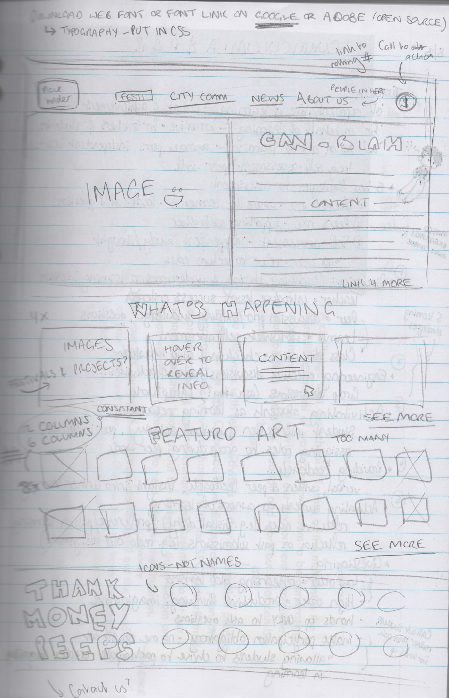
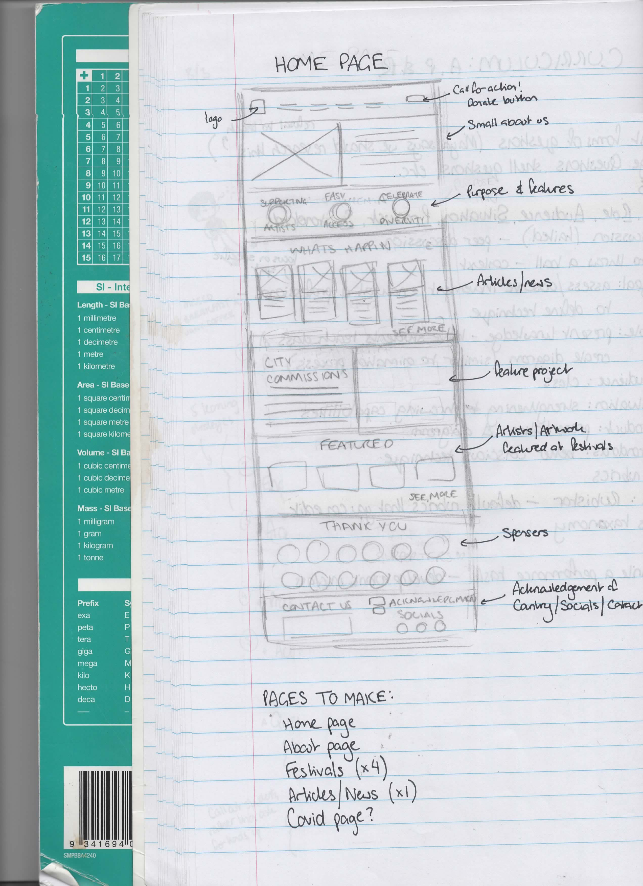
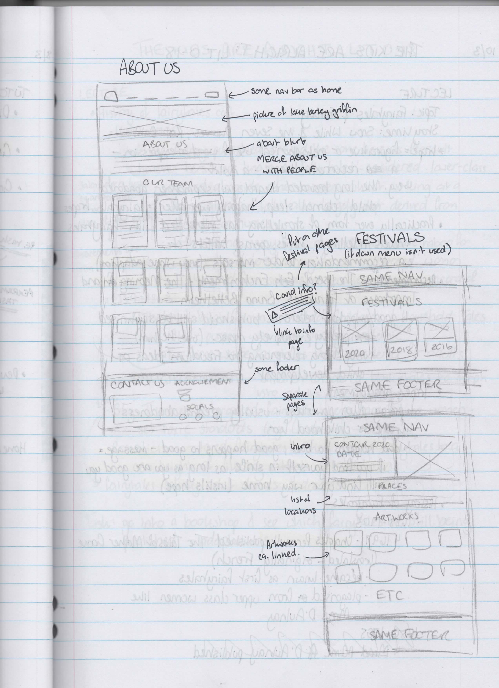

# **Reflection on Project 1: Responsive Website** #

As someone who has had no prior experience coding, this assessment has been one of the most challenging, yet intriging experiences I have ever had. 

When I began this project, I took great interest in researching the different techniques websites implemented into their deisgn to serve their brand image. Websites like [Frankie](https://www.frankie.com.au/) and [Headspace](https://www.headspace.com/?%243p=a_google_adwords&%24always_deeplink=false&lpurl=https%3A%2F%2Fwww.headspace.com%3Fgclsrc%3Daw.ds%26&~ad_set_id=72181210273&~campaign_id=1940234794&~channel=g&~keyword=headspace&~placement&gclid=Cj0KCQjwmPSSBhCNARIsAH3cYga5nELw15RfSCqdVtF9YLoEJ0vFjfOF5g9JUbSrDvFavTXBZqwS1TQaAoIFEALw_wcB&gclid=Cj0KCQjwmPSSBhCNARIsAH3cYga5nELw15RfSCqdVtF9YLoEJ0vFjfOF5g9JUbSrDvFavTXBZqwS1TQaAoIFEALw_wcB&gclsrc=aw.ds&%24web_only=true&_branch_match_id=973718026449198014&utm_source=Google%20AdWords&utm_medium=paid%20advertising&_branch_referrer=H4sIAAAAAAAAA72QXW%2BCMBSGf025Gx8tDllCFkTIdGab4pa5G3Jsa1ErrZTZ%2BO8HXvgTlpybc568eU7euuu0efK8mgMzGih%2FsHzrgtau3DdHj3ugzWwcK%2FPGts8Ih0QnUAmlhOQVMKtaZpz%2BDNLC1VSMcz3kkh1Iwx2pf1uZ1IMCkRThoh9rrXuXuVSdECkElaaliEzBuswg%2FOigKAdWGd5Ve5ZEOBgHOPBxRAZA4aRhL5oBBXHoYxJGcXgjNTQNl4kYliO%2FDu8ld5nTa%2FpIdvBfs%2BXBnj7KclJnb%2BlqZtIXQjcCRk2%2BsMFotSuzM%2FvqinizUPncvxSH3XsxEvH8c1u200sBl%2FX35Odsy2C9hFTNijxd2MrSyT8p%2BrKSW1V%2FCUjCvL4BAAA%3D) had me mesmorised, however, I quickly realised how unachievable their standards would be given my skill level and lack of experience. 

My final website was heavily inspired by the Geek Markets (website currently down for maintainence), [The Red Cross](https://www.redcross.org.au/) and [Minus 18](https://www.minus18.org.au/). I liked the way these sites utilised gridding and boxes to further their designs. I was particularly drawn to how [Minus 18](https://www.minus18.org.au/) used [cards](https://www.w3schools.com/howto/howto_css_cards.asp) to make their [news articles](https://www.minus18.org.au/articles) stand out. As such, I pushed myself to learn how to create them so I could incorporate them into my website. Their font sizing and spacing also stood out to me, as it seemed to make the website easier to navigate. contour556, in comparision, had terribly small font and poor font choice, which made content on pages (such as the [Supporters](https://webcache.googleusercontent.com/search?q=cache:sT8rPPtMbDIJ:https://www.contour556.com.au/supporters-1+&cd=2&hl=en&ct=clnk&gl=au) page) hard to read. As such, I tried to find a font that was similar to contour556's, but easier to read and matched with a clearer contrast font.  

My initial intention, when designing my lofi prototypes, was to create a website that exaggerated colour and incorporated the grid system into the design in order to invoke interest whilst keeping the design simple. My design changed a lot as I began to code and realise what I was actually capable of. In addition, I ended up choosing neutral colours over bold colours as I felt they better matched the colour palettes within the photos and the general feel of the website. Still, I was proud of what I did stay true to. Scans of my lofi prototype have been included below (see figures 1, 2 and 3. 

As I began to code my website, I found myself becoming increasingly frustrated and overwhelmed. My understanding of html and css was (and still is) shaking at best, and all the online tutorials I followed to achieve certain aspects (such as the responsive navbar and social media icons) relied on a solid understanding of code in order to incorporate the content they described effectively. My COVID-19 diagnosis added another layer of difficulty as I struggled to concentrate and missed chances to receive feedback from my peers due to quarantine. If it weren't for my classmate, Mitchell Bartlett, I couldn't have completed this assessment. Each day I worked on my code, we would call and he would go over the breaks in my website and slowly, but surely, teach me how to recognise breaks in my code for myself. We both struggled desperately with the grid system but in the end we managed to yeild an adequate result. Our approach did howevever present some challenges. 

As I began creating media queries, I found the margins I had set for the desktop version of my website greatly interfered with the positioning of my cards and images. No matter what we tried, neither Mitch nor I could fix the issue, and on the night of submission I chose not to submit the website as it was as I felt I would fail due to my website's poor responsiveness. I felt I needed feedback which I knew I could get in class the next day. 

Although I was told in class that I would've still passed had I submitted the website as it was, I'm glad I chose not to. The feedback I received from my tutor, Ben Butler, and my classmates, was incredibly valuable. Their feedback met that I could not only fix the issues with my margins (as well as some other bugs) but I could also make my site more accessible. They also helped me to realise how convoluted I had made my gridding system. It hurt to find out that I had used double, if not triple, the amount of css everyone else used but it was also a relief to find out that there was a similar way to grid a website than the way I had taken. I look forward to making this change in my future projects.

In summary, I am proud of my final result. It may not be the most flashy or efficient website but I've definitely learnt a lot! It was immensely frustrating spending hours typing and retyping code, only for it to break and absorb another hour as I floundered about trying to fix it, but every amount of content I managed to implement successfully felt amazingly fulfilling. Not to mention the grand appreciation I have now developed for website design. It's incredible how much work goes into something you might view for less than a second on any given day. I am astounded. As a future educator, I look forward to incorporating aspects of coding into my literacy teaching in hopes of inspiring and encouraging students to become coders and programmers. 

I have a long way to go before I can say I feel confident coding but I'm proud of how far I've come thus far. 

## Figure 1 ##

## Figure 2 ##

## Figure 3 ##

# **Reference List:** #
 Minus18. (n.d.) *We're Minus18*. (online) Available at: <https://www.minus18.org.au/>
 
 Geek Markets. (2022). *Geek Markets Countdown*. (online) Available at: <http://www.canberrageekmarkets.com.au/>
 
 Headspace. (2022). *Be Kind to your Mind*. (online) Available at: <https://www.headspace.com/?%243p=a_google_adwords&%24always_deeplink=false&lpurl=https%3A%2F%2Fwww.headspace.com%3Fgclsrc%3Daw.ds%26&~ad_set_id=72181210273&~campaign_id=1940234794&~channel=g&~keyword=headspace&~placement&gclid=CjwKCAjwu_mSBhAYEiwA5BBmf_Y-OSU4TaVUaDt2JQtpefFbk11nh1hYWlnebelG0nokfQajuShjFBoCTEEQAvD_BwE&gclid=CjwKCAjwu_mSBhAYEiwA5BBmf_Y-OSU4TaVUaDt2JQtpefFbk11nh1hYWlnebelG0nokfQajuShjFBoCTEEQAvD_BwE&gclsrc=aw.ds&%24web_only=true&_branch_match_id=973718026449198014&utm_source=Google%20AdWords&utm_medium=paid%20advertising&_branch_referrer=H4sIAAAAAAAAA72Q0WqDMBSGn0bvqk10sx2Eoa2ObbBR2m70KhxNNGpMQmMX%2BvbTXvQRCufmnI%2Bf7%2FCLcTT2JQwFB2YNVHzheBmAMYFsVR%2FyEIx9X621%2FWLlq4fjyBCgjdaN5BSY02dm%2FekM0sHVUsa5mXOkBmm5L83lLImYFV6UeriYxjkX3GVBpQcvKppK2nPlRVtwAbMefva9JAdGLR9py0iC0QphtMRJNIMKBgNto2aE1vESR3Gyjm9EgFJckmZeen6d3yN3mT9ppsimc5%2BbtHMXOuwzkZ7y1qVPWTbU9LT43h%2FjA%2FwcYTvij91oeF2UPUJKIHH6lYqXXL4tle7rHXSXveiKTG8Oeb5L%2F7Y0c%2FljDFNV5FbUP8QmHWW8AQAA>
 
 Australian Red Cross. (2022). *Grants for People Effected by Floods Are Now Open*. (online) Available at: <https://www.redcross.org.au/>
 
 CodingNepal. (2019). *How to Create Responsive Navigation Bar using HTML and CSS*. YouTube. (online) Available at: <https://www.youtube.com/watch?v=oLgtucwjVII&ab_channel=CodingNepal>
 
 The WebShala. (2020). *Responsive Footer Design using Html & Css*. YouTube. (online) Available at: <https://www.youtube.com/watch?v=YOb67OKw62s&ab_channel=TheWebShala>

